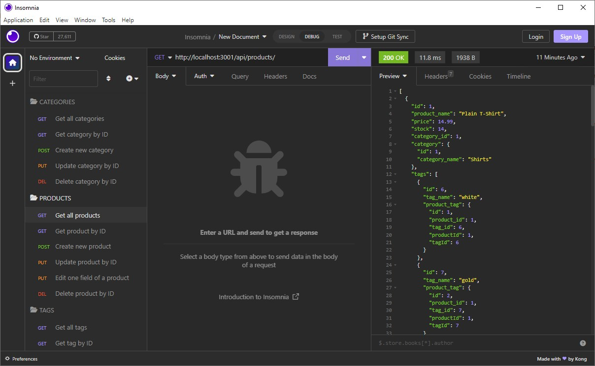

# E-Commerce Backend Demonstration
A simple proof of concept to showcase manipulating a MySQL database via a RESTful API. This codebase does not have a functioning website, but it contains the routes to handle requests that an e-commerce website might be making to its database.

## Installation / Testing
If you want to test out these routes yourself, you can check out [this in-depth walkthrough video I made](https://youtu.be/hTCWzHFfzC4), or you can just follow these written instructions:

1. Make sure you have MySQL installed on your computer, as well as Node.js and some kind of endpoint-testing software (such as Insomnia).
2. Clone or fork this repository
3. Put your MySQL username and password into the `.env.EXAMPLE` file, then rename the file to just `.env`. Be sure to leave the `DB_NAME` field as is.
4. Open a terminal in the `db` folder and use `mysql -u {your mysql username} -p` to open the mysql shell.
5. Create the database by entering `source schema.sql`
6. Exit the mysql terminal.
7. Enter the command `npm i` to install project dependencies (dotenv, express, mysql2, and sequelize)
8. Seed the database with sample data by entering `npm run seed`
9. Start the server with the command `npm start`
10. Use your endpoint-testing software at `http://localhost:{PORT}/api/{ENDPOINT}`
11. There's too many routes to explain here so it's best to watch the walkthrough video, the endpoint testing starts at [4:25](https://youtu.be/hTCWzHFfzC4?t=4m25s).

## License

Copyright 2023 Sumtwelve / Noah Nielsen

Permission is hereby granted, free of charge, to any person obtaining a copy of this software and associated documentation files (the “Software”), to deal in the Software without restriction, including without limitation the rights to use, copy, modify, merge, publish, distribute, sublicense, and/or sell copies of the Software, and to permit persons to whom the Software is furnished to do so, subject to the following conditions:

The above copyright notice and this permission notice shall be included in all copies or substantial portions of the Software.

THE SOFTWARE IS PROVIDED “AS IS”, WITHOUT WARRANTY OF ANY KIND, EXPRESS OR IMPLIED, INCLUDING BUT NOT LIMITED TO THE WARRANTIES OF MERCHANTABILITY, FITNESS FOR A PARTICULAR PURPOSE AND NONINFRINGEMENT. IN NO EVENT SHALL THE AUTHORS OR COPYRIGHT HOLDERS BE LIABLE FOR ANY CLAIM, DAMAGES OR OTHER LIABILITY, WHETHER IN AN ACTION OF CONTRACT, TORT OR OTHERWISE, ARISING FROM, OUT OF OR IN CONNECTION WITH THE SOFTWARE OR THE USE OR OTHER DEALINGS IN THE SOFTWARE.
